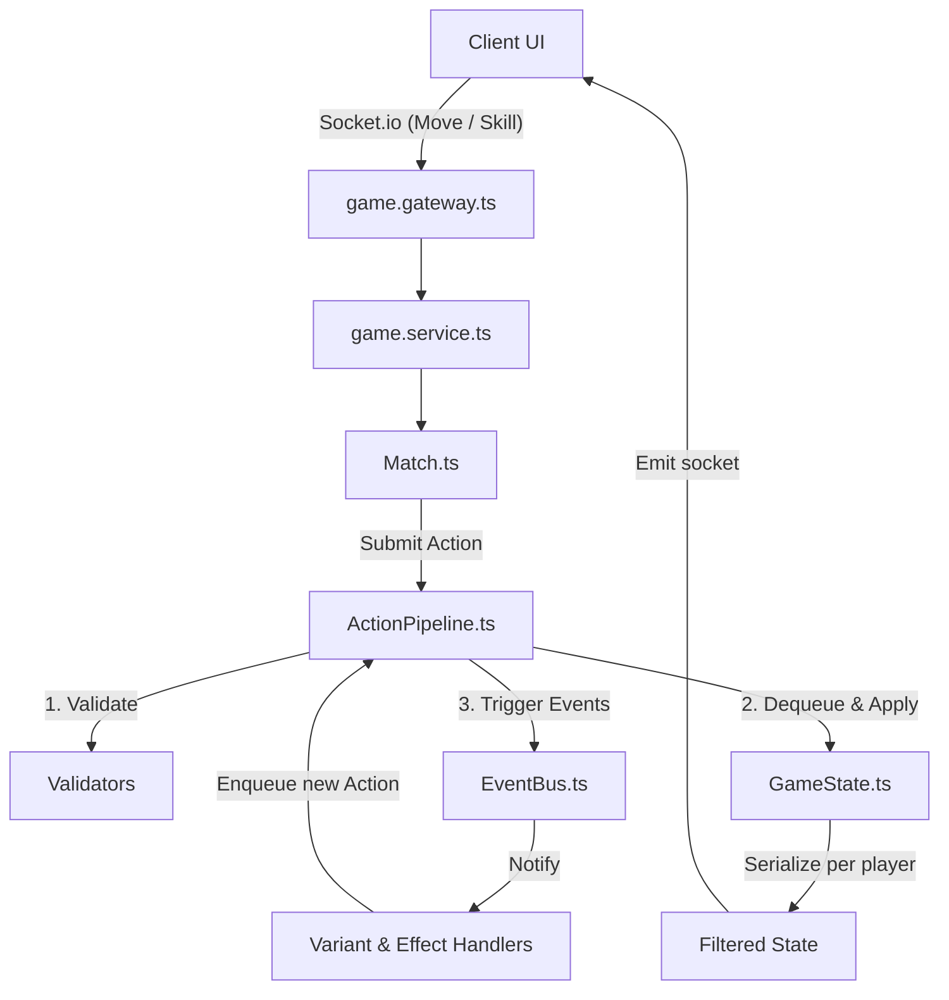

# AUDIT REPORT — CHESS VARIANTS ONLINE
*Báo cáo phân tích hệ thống và kiểm thử chất lượng mã nguồn*

---

## 1. TỔNG QUAN GAME

### Thể loại game & Gameplay Loop chính
Dự án là một game **Chess Variants Online (Cờ biến thể trực tuyến)** chơi theo lượt (1v1). Game kết hợp giữa luật cờ vua truyền thống mở rộng với các yếu tố hiện đại lấy cảm hứng từ thể loại MOBA:
*   **Drafting trước trận**: Mỗi người chơi chọn 1 bộ kỹ năng (Variant) riêng biệt và ẩn kín trước khi ghép trận (hỗ trợ cả trận đấu đối xứng - Mirror Match).
*   **Bàn cờ siêu lớn**: Kích thước 15x15 (225 ô) với 30 quân cờ mỗi bên (gấp đôi quân cờ thông thường, bao gồm 2 Hậu, 4 Xe, 4 Mã, 4 Tượng, 15 Tốt và 1 Vua).
*   **Kinh tế AP (Action Points)**: Điểm AP tích lũy thông qua cơ chế *Dual AP Reward* (cả hai bên cùng nhận AP khi có quân bị ăn: bên ăn nhận nhiều hơn, bên mất quân nhận một phần nhỏ để lật kèo). Điểm AP được dùng để kích hoạt các kỹ năng đặc biệt của Variant.
*   **Vòng lặp lượt chơi (Turn Loop)**: Mỗi lượt chơi gồm 5 phase: 
    1.  `Start Phase` (Kích hoạt hiệu ứng đầu lượt, giảm duration).
    2.  `Action Phase` (Người chơi bắt buộc phải di chuyển 1 quân cờ và có thể chọn dùng thêm tối đa 1 kỹ năng Variant nếu đủ AP. Trật tự cho phép: *Skill → Move* hoặc *Move → Skill* hoặc chỉ *Move*).
    3.  `Immediate Resolution` (Giải quyết di chuyển và ăn quân ngay lập tức).
    4.  `End Phase` (Kích hoạt hiệu ứng cuối lượt).
    5.  `Cleanup Phase` (Xóa các hiệu ứng hết hạn, cập nhật trạng thái bàn cờ).
*   **Điều kiện thắng**: Capture (ăn) hoặc tiêu diệt trực tiếp quân Vua của đối thủ bằng kỹ năng (không áp dụng luật chiếu hết/checkmate, King được đối xử như một quân cờ bình thường nhưng mang tính sống còn).

### Nền tảng/Engine đang sử dụng
Dự án được xây dựng dưới dạng monorepo sử dụng **npm Workspaces**:
1.  **Core Logic (`packages/game-core`)**: Viết hoàn toàn bằng **TypeScript/Node.js**, xử lý toàn bộ luật cờ, tính toán nước đi hợp lệ, quản lý hiệu ứng trạng thái (buff/debuff), và chuỗi hành động trong game.
2.  **Frontend (`apps/frontend`)**: Sử dụng **Next.js (React)**, TailwindCSS, và Socket.io-client để dựng giao diện bàn cờ tương tác và hiển thị kỹ năng.
3.  **Backend (`apps/backend`)**: Sử dụng **NestJS** tích hợp WebSocket Gateway (Socket.io) để điều phối phòng chơi (Room), ghép trận (Matchmaking), đồng bộ hóa trạng thái cờ thời gian thực, và xử lý ngắt kết nối/kết nối lại (reconnect).

### Trạng thái hiện tại
*   **Tỷ lệ hoàn thành**: Khoảng **95%**.
*   Các thành phần cốt lõi (board, movement, action pipeline, event bus, effect handlers, socket room, matchmaking) đã được lập trình hoàn chỉnh và kiểm thử tự động cực kỳ chặt chẽ (hơn 30 file `.spec.ts` trong backend).
*   **Các phần còn thiếu/dang dở**:
    *   **Luật hòa do lặp thế trận 3 lần (Threefold Repetition)** được ghi trong GDD nhưng hoàn toàn **chưa được cài đặt** trong mã nguồn (chưa có từ khóa `repetition` hay `threefold` nào xuất hiện).
    *   **Joker & Colossus**: Đang tạm hoãn implement theo yêu cầu thiết kế mới nhất.

### Danh sách các tính năng (Features)

| Trạng thái | Tên tính năng | File mã nguồn / Mô tả chi tiết |
| :--- | :--- | :--- |
| **Đã Xong** | Bàn cờ 15x15 & 30 quân cờ | [Board.ts](file:///d:/Variants/packages/game-core/src/board/Board.ts), [initialLayout.ts](file:///d:/Variants/packages/game-core/src/pieces/initialLayout.ts) |
| **Đã Xong** | Luật di chuyển cờ mở rộng | Có thêm bước Lateral Step cho Bishop (di chuyển ngang 1 ô) trong [bishopMoves.ts](file:///d:/Variants/packages/game-core/src/movement/bishopMoves.ts). |
| **Đã Xong** | Action Pipeline & Event Bus | [ActionPipeline.ts](file:///d:/Variants/packages/game-core/src/action/ActionPipeline.ts), [EventBus.ts](file:///d:/Variants/packages/game-core/src/event/EventBus.ts) điều phối vòng đời game. |
| **Đã Xong** | Hệ thống Effect buff/debuff | Gồm 35 handlers xử lý các trạng thái như Stun, Silence, Shield, Poison Bomb, Walker, Zombie, Berserk, Fate, v.v. tại [effect/handlers](file:///d:/Variants/packages/game-core/src/effect/handlers). |
| **Đã Xong** | 27 Variants chính | Lightning, Zombie, Dynamite, Magician, Nephalem, Guardian, Requiem, Kaze (Kazehime), Predator, Verdant Dragon, Thunder Dragon, Water Turtle (Turtle), Angel, Devil, Phantom, Cannibal, Wizard, Earth, Time, Lord, Dragon Sentinel, Cherubim, Ruler, Phoenix, Space, Puppet, Pirate. |
| **Đã Xong** | Bất đối xứng thông tin (Stealth) | Ẩn bẫy cờ (landmine/thunder_trap) và quân cờ tàng hình của đối thủ trong [GameState.ts#L179-L230](file:///d:/Variants/packages/game-core/src/state/GameState.ts#L179-L230) (`serializeForPlayer`). |
| **Đã Xong** | Rollback/Tua ngược thời gian | Sử dụng [Snapshot.ts](file:///d:/Variants/packages/game-core/src/state/Snapshot.ts) lưu lại trạng thái bàn cờ qua các lượt để Time Variant có thể quay lui 1 hoặc 5 lượt. |
| **Đã Xong** | WebSocket Gateway & Lobby | [game.gateway.ts](file:///d:/Variants/apps/backend/src/game/game.gateway.ts) quản lý tạo phòng, vào phòng, ghép trận, xác nhận variant, đếm ngược thời gian, và reconnect trong 60 giây. |
| **Chưa làm** | Hòa do lặp thế trận | Chưa có code phát hiện lặp lại thế trận (Threefold Repetition). |
| **Tạm hoãn** | Joker & Colossus | Tạm hoãn thực hiện. |

---

## 2. KIẾN TRÚC TECHNICAL

### Cấu trúc thư mục tổng thể

```
Variants/
├── apps/
│   ├── backend/                      # NestJS backend API & WebSocket Server
│   │   └── src/
│   │       ├── game/                 # Quản lý Room, Gateway và Service
│   │       └── *.spec.ts             # Bộ test tự động khổng lồ cho từng Variant
│   └── frontend/                     # Next.js React client UI
├── packages/
│   └── game-core/                    # Logic lõi của trò chơi (TypeScript)
│       └── src/
│           ├── board/                # Board.ts (quản lý lưới cờ), Position.ts
│           ├── pieces/               # Định nghĩa các quân cờ và sắp xếp ban đầu
│           ├── movement/             # Tính toán nước đi hợp lệ của cờ (MoveGenerator.ts)
│           ├── state/                # Trạng thái game (GameState.ts) và Snapshots
│           ├── action/               # Hàng đợi hành động (ActionPipeline.ts, Action.ts)
│           ├── effect/               # Hệ thống buff/debuff và 35 handlers
│           ├── variant/              # VariantRegistry.ts, định nghĩa skill và các file variant
│           ├── event/                # EventBus.ts phát và lắng nghe sự kiện vòng đời
│           ├── modifier/             # MoveModifierChain.ts để sửa đổi nước đi
│           └── combat/               # Phát hiện chiếu và tấn công (AttackDetection.ts)
├── docs/                             # Tài liệu GDD.md
└── *.md                              # Các bản kế hoạch triển khai (Phoenix, Turtle, v.v.)
```

### Kiến trúc tổng thể (Architectural Patterns)
Hệ thống sử dụng kiến trúc **Event-Driven (Hướng sự kiện)** kết hợp với **Action Pipeline** và **Plugin System** (dành cho các Variant):
1.  **Action Pipeline**: Mọi hành vi làm thay đổi trạng thái game (Move, Capture, Use Skill, Apply/Remove Effect, GameOver) đều được đóng gói thành các đối tượng `Action` gửi vào `ActionPipeline`. Nó sẽ đi qua các validator (như `BasicMoveValidator`, `APValidator`, v.v.) trước khi được đưa vào hàng đợi `ActionQueue`.
2.  **Event Bus**: Khi một Action được thực thi thành công, pipeline sẽ kích hoạt sự kiện tương ứng qua `EventBus` (ví dụ `OnMove`, `OnCapture`, `OnPieceDeath`).
3.  **Variant Plugins**: Các Variant được đăng ký động vào trận đấu. Chúng đăng ký lắng nghe các sự kiện của `EventBus` hoặc đăng ký bộ sửa đổi nước đi vào `MoveModifierChain`. Khi sự kiện nổ ra, chúng có thể tự động sinh ra các Action mới đẩy vào hàng đợi (ví dụ: Zombie ăn quân phát ra `OnCapture` -> tự động kích hoạt sinh thêm quân `Walker`).



### Các hệ thống cốt lõi và mối liên kết
*   **Hệ thống Luật Cờ (Board & Movement)**: Cung cấp vị trí và khả năng di chuyển cơ bản của quân cờ.
*   **Hệ thống Sửa đổi Nước đi (Move Modifier Chain)**: Cho phép các hiệu ứng (như Stun, Bind) can thiệp để loại bỏ hoặc thêm nước đi hợp lệ của quân cờ trước khi trả kết quả về UI.
*   **Hệ thống Hiệu ứng (Effect System)**: Lưu trữ các trạng thái thay đổi tạm thời trên quân cờ/người chơi/ô cờ và quản lý việc giảm thời gian (tick duration) cuối mỗi lượt.
*   **Hệ thống Trận đấu & Phòng (Match & Room)**: Liên kết WebSocket client với một instance game-core cụ thể, thực hiện ghép trận và đếm ngược thời gian.

### Các Design Pattern quan trọng
1.  **Chain of Responsibility (MoveModifierChain)**: Cho phép chạy qua nhiều bộ lọc hiệu ứng khác nhau để quyết định xem một ô cờ có thể đi vào được không (ví dụ: kiểm tra xem có bị Stun, bị cấm đi vào ô có Flame, bị cản bởi Mountain hay không).
2.  **Registry Pattern**: Sử dụng trong `VariantRegistry`, `EffectRegistry`, và `SpecialPieceRegistry` để quản lý việc nạp động các chức năng mà không cần viết code cứng (hardcode) trong engine core.
3.  **Observer Pattern**: Sử dụng `EventBus` để liên kết lỏng lẻo (loose coupling) giữa logic cốt lõi và các hiệu ứng variant phức tạp.
4.  **Memento Pattern**: Lớp `SnapshotManager` chụp lại và khôi phục trạng thái `GameState` để phục vụ cơ chế quay ngược thời gian.

### Luồng di chuyển dữ liệu (Data Flow)
1.  **Gửi hành động**: Người chơi chọn ô đi cờ hoặc nhấp dùng Skill -> Frontend phát sự kiện WebSocket `move` hoặc `use-skill` kèm tọa độ/mục tiêu.
2.  **Xử lý ở Server**: Server nhận event -> Gọi `Match.makeMove` hoặc `Match.useSkill` -> Chạy qua pipeline để thay đổi `GameState` -> Chạy các chuỗi phản ứng phụ từ kỹ năng khác.
3.  **Bất đối xứng thông tin**: Server gọi `Match.serializeForPlayer(playerColor)`. Hàm này sẽ tự động che giấu các ô cờ có bẫy ẩn của đối thủ hoặc các quân cờ tàng hình (chỉ người sở hữu mới thấy được).
4.  **Phản hồi**: Server gửi trạng thái đã được lọc riêng biệt về socket của từng người chơi để cập nhật giao diện cờ.

---

## 3. CHI TIẾT KỸ THUẬT QUAN TRỌNG

### Các Class/File quan trọng nhất

*   [Match.ts](file:///d:/Variants/packages/game-core/src/match/Match.ts): Cổng giao tiếp chính của mỗi game session. Khởi tạo toàn bộ registry, event bus, pipeline và lưu trữ lịch sử di chuyển.
*   [ActionPipeline.ts](file:///d:/Variants/packages/game-core/src/action/ActionPipeline.ts): Nơi xử lý vòng lặp hành động. Chứa logic cộng AP (Dual AP reward) và kiểm tra Vua chết để kết thúc trận.
*   [GameState.ts](file:///d:/Variants/packages/game-core/src/state/GameState.ts): Chứa cấu trúc dữ liệu của toàn bộ bàn cờ, thông số AP, số lượt, danh sách quân cờ đã chết (graveyard), và trạng thái riêng biệt của từng Variant.
*   [MoveGenerator.ts](file:///d:/Variants/packages/game-core/src/movement/MoveGenerator.ts): Động cơ tính toán các nước đi thô theo luật cờ của từng quân.
*   [EffectRegistry.ts](file:///d:/Variants/packages/game-core/src/effect/EffectRegistry.ts): Đăng ký 35 loại hiệu ứng và liên kết chúng vào validation pipeline và move modifier chain.
*   [game.gateway.ts](file:///d:/Variants/apps/backend/src/game/game.gateway.ts): Điểm tiếp nhận kết nối Socket.io, điều phối quá trình đraft cờ và đếm ngược thời gian của mỗi lượt.

### Các Dependency bên ngoài
*   Phía **Backend**: Sử dụng NestJS làm khung ứng dụng API và WebSocket server.
*   Phía **Frontend**: Sử dụng Next.js (React), TailwindCSS cho giao diện và Socket.io-client để kết nối thời gian thực.
*   **Công cụ chạy/build**: Sử dụng `concurrently` để chạy song song client & server khi chạy dev.

### Quản lý trạng thái & Save/Load
*   **State Management**: Trạng thái game được lưu trực tiếp trên bộ nhớ RAM của server dưới dạng một map các phòng chơi (`rooms` map trong `GameService`).
*   **Save/Load (Snapshots)**: Mỗi khi một lượt mới bắt đầu (`START_TURN`), `SnapshotManager` sẽ deep-clone trạng thái `GameState` hiện tại và lưu vào mảng. Khi kỹ năng tua thời gian của Time Variant được kích hoạt, hệ thống sẽ khôi phục lại trạng thái game từ snapshot của lượt trước đó, giúp rollback toàn bộ bàn cờ (ngoại trừ các quân cờ đã bị ăn).

### Performance-critical Code
*   **Tính toán nước đi**: Việc gọi `MoveModifierChain.computeLegalMoves` diễn ra liên tục khi người chơi chọn quân cờ. Trên bàn cờ 15x15 với số lượng quân cờ lớn, các hàm lọc nước đi cần được tối ưu hóa để tránh lặp lại quét toàn bộ bàn cờ nhiều lần.
*   **Tránh lặp vô hạn**: Các kỹ năng của Variant có thể tạo ra chuỗi phản ứng dây chuyền (ví dụ: nổ bom kích hoạt nổ bom khác, hoặc di chuyển kích hoạt bẫy). `ActionPipeline` giới hạn cứng `safetyLimit = 500` hành động trong 1 turn để tránh làm sập server nếu xảy ra vòng lặp vô hạn.

### Coding Convention
*   **TypeScript strict-mode**: Sử dụng static typing chặt chẽ cho tọa độ (`Position`), màu quân cờ (`Color`), loại quân cờ (`PieceType`).
*   **PascalCase** cho tên file class và type (`GameState.ts`, `ActionPipeline.ts`).
*   **kebab-case** cho các thư mục hoặc file spec phụ trợ.

---

## 4. VẤN ĐỀ & RỦI RO

### Code Smell & Technical Debt
1.  **Thiếu cơ chế hòa cờ**: Game hoàn toàn chưa có logic phát hiện hòa do lặp thế trận (Threefold Repetition) hay do luật 50 nước đi không ăn quân/không đi tốt. Điều này dẫn đến nguy cơ trận đấu kéo dài vô tận nếu cả hai bên chỉ di chuyển King qua lại.
2.  **Sự phụ thuộc chéo giữa các Variant**: Một số variant có logic sửa đổi hoặc khắc chế trực tiếp hiệu ứng của variant khác (ví dụ: `TurtleVariant` hoán đổi buff/debuff cơ bản, `Cherubim` xóa hiệu ứng bất lợi). Khi thêm một Variant mới hoặc chỉnh sửa một Handler (như `StunHandler`), có rủi ro cao làm hỏng logic của các Variant hiện tại.
3.  **Xung đột trạng thái trong Mirror Match (Trận đấu đối xứng)**:
    *   Nhiều Variant (như `Zombie`, `Verdant Dragon`, `Time`, `Space`, `Ruler`, `Devil`) đang ghi đè và chia sẻ chung các thuộc tính trạng thái trực tiếp trên `state.variantState` toàn cục duy nhất.
    *   Ví dụ: Nếu cả hai cùng chơi Zombie, việc White dùng chiêu `Infection` miễn phí sẽ làm giảm số lần dùng miễn phí (`freeInfectionRemaining`) của Black. Nếu cả hai cùng chơi Verdant Dragon, điểm `dragonCounter` tích lũy chung khiến cả hai cùng đạt mốc 100 và mở khóa chiêu cuối sớm một cách bất thường.
4.  **Double-Ticking giảm thời lượng hiệu ứng**:
    *   Trong Mirror Match, do cả hai bên đều load Event Handler giống nhau (ví dụ: `DevilTollHandler` lắng nghe `OnTurnEnd` hoặc hook giảm thời lượng của `Ruler`), khi một turn kết thúc, cả hai Handler/Hook này đều được kích hoạt độc lập và cùng giảm thời lượng của hiệu ứng chung. Kết quả là `Hellish Toll` hoặc `Absolute Domain` hết hạn nhanh gấp đôi bình thường (giảm 2 lượt thay vì 1 lượt mỗi round).
5.  **Lỗi bất nhất giữa Màu sắc quân cờ (piece.color) và Người sở hữu thực tế (getPieceOwner)**:
    *   Trong các cơ chế Possess/Control/Infect (Zombie Walker type 1, Puppet Master control), một quân cờ thuộc màu này (`piece.color === Color.Black`) nhưng được điều khiển bởi người chơi đối diện (`getPieceOwner(piece) === Color.White`).
    *   **Lỗi bẫy và hiệu ứng ô**: Các Handler như `LandmineHandler`, `SoullessCellHandler`, `RepelHandler`, `PuppetTrapHandler`, `DragonsRoarBeamHandler` kiểm tra bẫy kích hoạt qua `e.sourcePlayer !== piece.color`. Điều này khiến quân bị possess kích hoạt bẫy của chính đồng đội mình (chủ mới) và miễn nhiễm với bẫy đối phương!
    *   **Lỗi rò rỉ thông tin ẩn (Stealth visibility leak)**: Trong `GameState.ts#serializeForPlayer`, kiểm tra tàng hình dùng `piece.color !== player`. Kết quả là chủ mới (White) không thể nhìn thấy quân cờ tàng hình mình đang sở hữu, trong khi đối thủ (Black - chủ cũ) vẫn nhìn thấy quân cờ đó bình thường!
    *   **Lỗi di chuyển/tấn công**: `CellEffectBlockModifier.ts` dùng `piece.color` để lọc di chuyển trên địa hình `outworld`. Điều này chặn quân bị possess di chuyển vào địa hình outworld thân thiện của chủ mới và cho phép đi vào outworld của đối thủ. Ngoài ra, Walker vẫn có thể check/tấn công Vua đối phương trong `AttackDetection.ts` vì tính sai màu đối thủ (`piece.color` thay vì `getPieceOwner`).
    *   **Lỗi phong cấp Tốt bị possess (Possessed Pawn Promotion)**: Khi kiểm tra phong cấp, hệ thống dựa vào `piece.color` để xác định hàng phong cấp (hàng 14 với White, hàng 0 với Black). Một Tốt Black bị White possess vẫn sẽ di chuyển về phía hàng 0 (sân nhà của White) và phong cấp tại đây thay vì phong cấp ở hàng 14 (sân Black), gây bất hợp lý về mặt chiến thuật.
    *   **Lỗi Handler**: `ThunderFangHandler`, `StealthMaintenanceHandler`, `TimeFreezeHandler`, và `BerserkHandler` đều check `piece.color` trực tiếp dẫn đến không nhận diện đúng lượt hoạt động hoặc đối thủ của quân bị possess.
6.  **Thiếu AP phục hồi khi quân bị tiêu diệt bởi kỹ năng (No AP Refund on Skill Destruction)**:
    *   Khi quân cờ bị ăn bình thường (`CAPTURE`), người chơi mất quân sẽ nhận được lượng `LOSS_AP` để hồi phục kinh tế. Tuy nhiên, khi quân cờ bị tiêu diệt trực tiếp bởi kỹ năng (`DESTROY_PIECE` như Earth Burst, Supernova, Landmine), người sở hữu quân cờ nhận **0 AP recovery** (trừ khi có hiệu ứng `verdant_shelter` bảo hộ), tạo ra sự mất cân bằng tài nguyên rất lớn giữa các variant có kỹ năng diệt quân trực tiếp và các variant thường.
7.  **Lỗi thiết kế của SnapshotManager trong khôi phục lượt (Rollback)**:
    *   `SnapshotManager` lưu trữ snapshots theo `turnNumber`. Tuy nhiên, `turnNumber` thực chất đại diện cho số Round (chỉ tăng khi đến lượt White).
    *   Do đó, snapshot của White và Black ở cùng 1 round có trùng `turnNumber`. Khi dùng `snapshots.restore(turnsBack)`, cơ chế `find` luôn trả về snapshot đầu tiên của round đó (lượt White).
    *   Kết quả là không thể khôi phục trạng thái về đầu lượt của Black, và việc rollback `1` lượt từ lượt White sẽ nhảy lùi tận `2` lượt (về đầu lượt White round trước).
8.  **Lỗi đe dọa không thực tế của Puppet Master (Pre-control Threat)**:
    *   Trong 2 lượt đầu của `Puppet Master` (giai đoạn tiền điều khiển), quân cờ bị xích không được phép ăn quân (tương tự Walker).
    *   Tuy nhiên, `AttackDetection.ts` không lọc thuộc tính này, khiến quân cờ này vẫn được xem là đang tấn công/chiếu Vua đối phương, gây ra các sự kiện Check/Checkmate giả.

### Trùng khớp thông tin & Sai lệch tài liệu (Spec discrepancy)
*   **Vấn đề AP của Guardian Ultimate**: Trong file [game-core-guardian.spec.ts:545](file:///d:/Variants/apps/backend/src/game-core-guardian.spec.ts#L545), có đoạn test đặt mục tiêu AP cho chiêu cuối của Guardian là **8 AP**. Tuy nhiên, tài liệu thiết kế trò chơi [Variants.md](file:///d:/Variants/Variants.md) lại không ghi rõ lượng AP tiêu hao cho chiêu này (chỉ mô tả tính năng). Cần đồng bộ hóa để tránh việc code test chạy một đằng nhưng thiết kế yêu cầu một nẻo (thông thường các Ultimate tốn 9-11 AP).
*   **Bộ test backend bị lỗi khi thêm Variant mới**:
    *   Hiện tại, việc tích hợp thêm `PirateVariant` (nâng tổng số variant lên 27) đã khiến file test [ap-cost-migration.spec.ts](file:///d:/Variants/apps/backend/src/ap-cost-migration.spec.ts) bị crash do mong đợi cứng số lượng variant là `26` và thiếu định nghĩa cost kiểm thử cho `PirateVariant`.

### Fragile Code (Mã nguồn dễ lỗi)
*   **Resolve Vua chết trong ActionPipeline**: Logic kiểm tra Vua chết ở dòng L322-L340 của `ActionPipeline.ts` được chạy sau khi rút hết hàng đợi hành động. Việc này hoạt động tốt cho cờ vua chuẩn, nhưng với **Fire Phoenix Variant** (khi Vua chết lần đầu sẽ tự hủy toàn bộ quân ta và hồi sinh một đội quân mới tại vị trí xuất phát), logic này sẽ vô cùng dễ bị lỗi do xung đột thời gian (timing) xử lý cái chết của Vua và việc chặn sự kiện GameOver.

---

## 5. GỢI Ý BƯỚC TIẾP THEO

### Thứ tự ưu tiên phát triển tiếp theo
1.  **Sửa lỗi test suite backend**: Cập nhật lại số lượng variant mong đợi lên 27 trong [ap-cost-migration.spec.ts](file:///d:/Variants/apps/backend/src/ap-cost-migration.spec.ts) và bổ sung kiểm thử AP cost cho `PirateVariant`.
2.  **Xây dựng cơ chế phát hiện hòa do lặp thế trận (Threefold Repetition)**:
    *   Thêm mảng lưu trữ hash của bàn cờ ở mỗi lượt chơi vào `GameState`.
    *   Trong `ActionPipeline` sau khi kết thúc lượt di chuyển, kiểm tra nếu trạng thái bàn cờ hiện tại xuất hiện lần thứ 3 -> tự động kích hoạt Action `GAME_OVER` với kết quả là hòa (Draw).

### Đề xuất Refactor
*   **Phân rã variantState theo Player**: Refactor cấu trúc `state.variantState` thành các vùng chứa riêng biệt cho White và Black (ví dụ `state.variantState.white` và `state.variantState.black` hoặc lưu dạng `variantState[player][variantId]`) nhằm loại bỏ hoàn toàn việc ghi đè chéo dữ liệu và xung đột trong Mirror Match.
*   **Chuẩn hóa Cell Effects**: Hiện tại các hiệu ứng ô cờ như `flame`, `mountain` được check thủ công trong `MoveGenerator.ts` hoặc các hàm tìm nước đi. Nên refactor chúng thành các Move Modifier thực thụ đăng ký trong `MoveModifierChain` để giữ cho `MoveGenerator` thuần khiết và dễ mở rộng khi thêm các địa hình mới.
*   **Tự động hóa lấy số lượng Variant trong Spec**: Thay đổi assertions kiểm tra số lượng Variant trong `ap-cost-migration.spec.ts` bằng cách so sánh động với tổng số variant đăng ký trong `VariantRegistry` thay vì fix cứng số `26` hay `27` để tránh lặp lại lỗi khi thêm variant mới trong tương lai.
